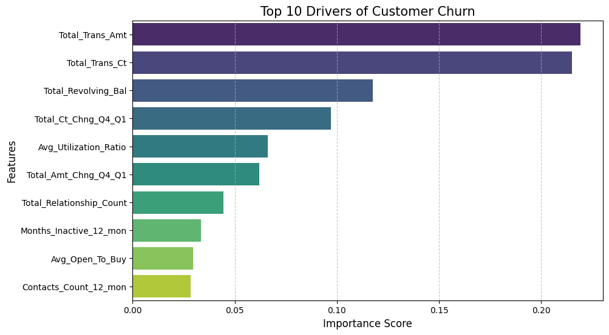
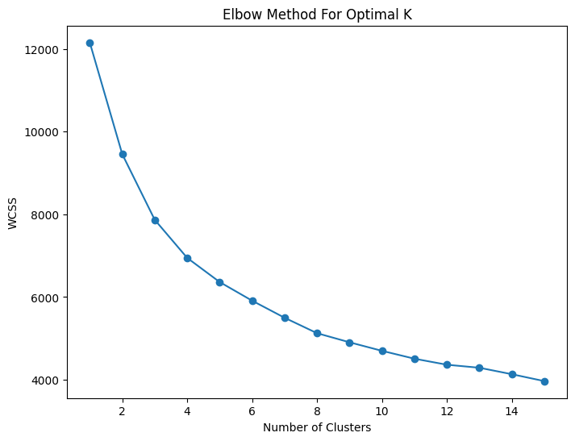
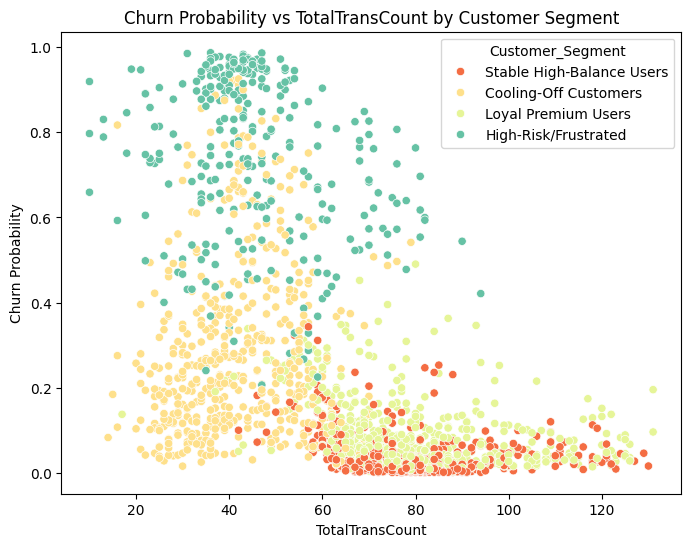

# 🚀 Credit Card & Telecom Churn: Predictive Analytics & Strategy Engine

## 📌 Overview
This project delivers a comprehensive, end-to-end data science solution to identify customer churn, quantify financial risk, and deploy targeted retention strategies. By bridging the gap between raw machine learning metrics and business operations, this pipeline transforms data into actionable revenue-saving decisions.

## 📂 Dataset
The dataset used for this project is [(https://www.kaggle.com/code/josh1337/bankchurners?scriptVersionId=86290999)]
A processed copy is available in the `data/` folder of this repository.

## 🛠 Project Workflow
* **Data Foundation**: Rigorous data cleaning (handling nulls, outliers) and feature engineering using `StandardScaler` to ensure robust model performance.
* **Exploratory Data Analysis (EDA)**: Performed multi-variate analysis to uncover hidden correlations between usage patterns, tenure, and churn probability.
* **Predictive Modeling**: 
    * Implemented **Random Forest Classifier** with `class_weight='balanced'` to effectively handle class imbalance.
    * Achieved **98% AUC score**, validated via extensive Confusion Matrix analysis.
    * Employed **5-Fold Cross-Validation** to ensure the model generalizes across unseen data.
* **Advanced Customer Segmentation**: 
    * Applied **K-Means Clustering** with the Elbow Method to identify 4 distinct customer personas, moving beyond binary "Churn/No-Churn" labels.

## 💡 Strategic Business Framework
I integrated three analytical enhancements to ensure the model delivers tangible business value:

1. **Financial Risk Quantification:** Developed a logic to map `ChurnProbability` against `TotalRevBalance`, identifying **"Revenue at Risk."** This allows stakeholders to prioritize high-value customer retention efforts.
2. **Actionable Retention Strategy Map:** Programmatically assigned tailored retention tactics based on segment profiles:

| Segment | Strategic Focus | Primary Action |
| :--- | :--- | :--- |
| **Loyal Premium** | Maximization | Exclusive rewards & VIP tiers. |
| **Stable High-Balance**| Engagement | Personalized financial planning tools. |
| **Cooling-Off** | Re-activation | Targeted win-back campaigns & discounts. |
| **High-Risk** | Retention | Immediate "Save Team" outreach & audits. |

3. **Explainable AI (XAI):** Pivoted from "Black Box" modeling to focus on **Top 10 Churn Drivers**. By visualizing features like *Transaction Frequency* and *AvgUtilization*, I provided stakeholders with clear, understandable insights into "Why customers are leaving."

## 📊 Key Visualizations
*(Note: Replace these image links with your actual image file paths in the repo)*
- **Top 10 Churn Drivers:** 
- **Optimal Segmentation (Elbow Method):** 
- **Churn Risk Clustering:**
- 

## 🛠 Tech Stack
* **Language**: Python
* **Libraries**: Pandas, NumPy, Seaborn, Matplotlib, Scikit-Learn
* **Models**: RandomForestClassifier, KMeans Clustering

## 🚀 Deployment & Live Application
To bridge the gap between technical modeling and business accessibility, I have deployed this solution as an interactive web application.

- **Interactive Interface:** Built using **Streamlit**, allowing stakeholders to perform live churn predictions by inputting customer parameters.
- **Model Integration:** Used `joblib` for seamless model serialization, ensuring the trained **Random Forest Classifier** is accessible for real-time inference within the dashboard.
- **Dynamic Insights:** The app provides instant visualization of churn risks, allowing for rapid decision-making without requiring coding expertise.

---

## 🔗 Live Insights & Feedback
[🚀 View Interactive Portfolio & Chat with AI Assistant](INSERT_YOUR_CARRD_LINK_HERE)
**Access the Live App:** [https://credit-card-customer-churn-analytics-engine-43zmqrhu8ysrkqtixz.streamlit.app/]
**Access the My AI Chatbot Here:[https://creator.voiceflow.com/share/6a3bf0cb8ec1b1de6273cb98/environment/main/published]
*Feedback is highly appreciated! Feel free to share your thoughts through my [feedback portal]([(https://tally.so/r/1AOeMW)]).*

---
*Created by [Kanav Bansal]*
